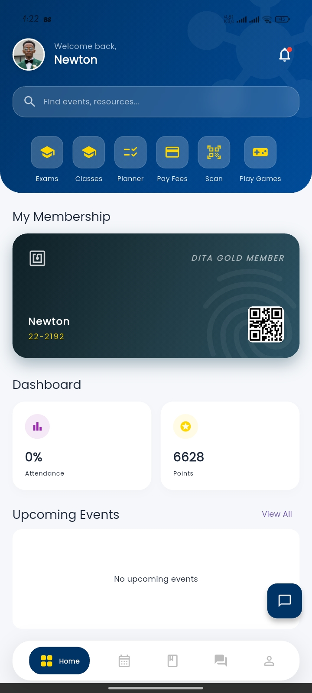
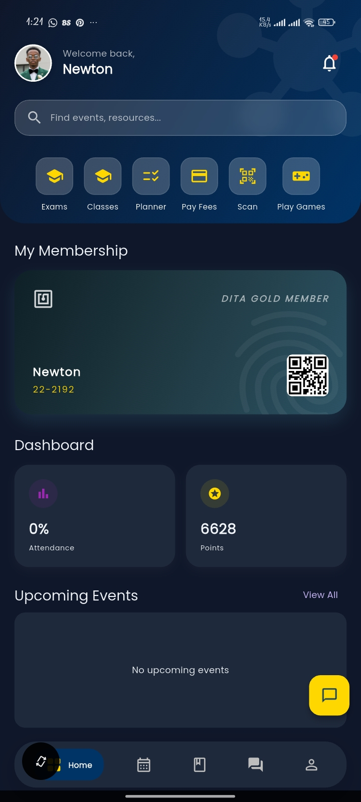
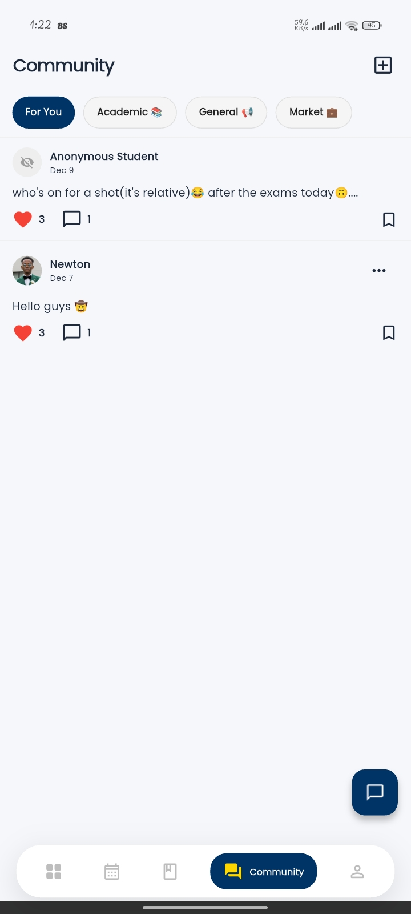
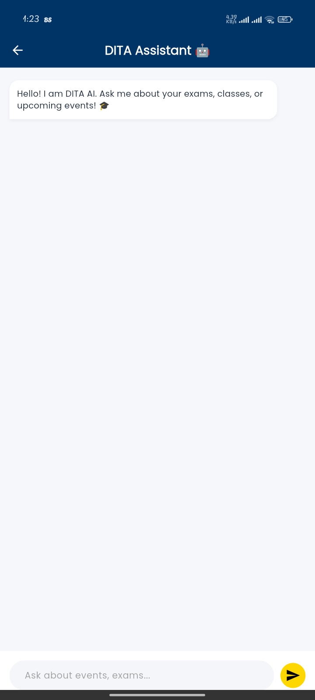

# 🎓 DITA App - The Ultimate Student Companion


DITA App is the official mobile application for the Daystar Information Technology Association (DITA). It serves as a comprehensive digital companion for students, integrating academic tools, social features, and campus services into a single, polished platform.

Designed with a **Midnight Blue & Gold** aesthetic, the app features a robust **Dark Mode**, **Offline Capabilities**, and an **AI Assistant** powered by Gemini 2.5.

## ✨ Key Features

### 🧠 Intelligent Assistance

- **DITA AI Assistant**: A context-aware chatbot (Gemini 2.5 Flash) that knows the user's specific timetable, exam schedule, and campus details.
- **Smart Answers**: Ask "When is my next exam?" or "Where is the nursing block?" and get instant, personalized responses.

### 📅 Academic Management

- **Exam Timetable**: Automatically fetches exam dates. Works **Offline** via local caching.
- **Class Schedule**: Syncs directly from the Student Portal (via secure WebView extraction) or allows manual entry.
- **Smart Reminders**:
  - **Exams**: Alerts the evening before and 1 hour before the paper.
  - **Classes**: Alerts the evening before and 30 minutes before the session.

### 💬 Social & Community

- **Community Hub**: An Instagram-style feed for students to share news, ask academic questions, or sell items (Marketplace).
- **Lost & Found**: Report lost items with photo uploads. Owners can mark items as "Found" to resolve cases.
- **Gamified Leaderboard**: Earn points by attending DITA events and scanning QR Codes. Compete for the top rank!

### 🛠️ Utilities

- **Secure Payments**: Integrated M-Pesa (STK Push) for paying club membership fees.
- **Task Planner**: A built-in To-Do list to track assignments.
- **Resources Library**: Access past papers and PDF notes (Gold Members only).
- **Biometric Login**: Secure entry using Fingerprint/Face ID.

### 🎨 UI/UX Highlights

- **True Dark Mode**: A sleek "Midnight Navy" theme that activates automatically based on system settings.
- **Glassmorphism**: Modern translucent effects in search bars and headers.
- **Empty States**: Custom SVG illustrations for empty screens (No tasks, No internet, etc.).
- **Optimistic UI**: Instant feedback for "Likes" and "Posts" before the server responds.

## 📸 Screenshots

| Home (Light) | Dark Mode | Community | AI Assistant |
|--------------|-----------|-----------|--------------|
|  |  |  |  |

## 🛠️ Tech Stack

### Mobile (Frontend)

- **Framework**: Flutter (Dart)
- **State Management**: setState + SharedPreferences (Local Caching)
- **Networking**: http
- **Notifications**: awesome_notifications + firebase_messaging
- **Scanning**: mobile_scanner (QR Codes)
- **AI**: google_generative_ai (Gemini API)

### Backend (API)

- **Framework**: Django REST Framework (Python)
- **Database**: PostgreSQL (Production) / SQLite (Dev)
- **Auth**: JWT (SimpleJWT)
- **Storage**: Cloudinary (Profile Pictures & Media)
- **Hosting**: Render
- **Updates**: Shorebird (Code Push)

## 🚀 Getting Started

### Prerequisites

- Flutter SDK installed.
- Python 3.10+ installed.
- A Firebase project (for Push Notifications).
- A Cloudinary account (for Image Storage).

### 1. Clone the Repository
```bash
git clone https://github.com/Iconia7/Dita-app.git
cd dita-app
```

### 2. Backend Setup

Navigate to the backend folder and set up the virtual environment.
```bash
cd backend
python -m venv venv
source venv/bin/activate  # On Windows: venv\Scripts\activate
pip install -r requirements.txt
```

**Configure Environment Variables**: Create a `.env` file in the backend root:
```env
SECRET_KEY=your_django_secret
DEBUG=True
CLOUDINARY_CLOUD_NAME=your_cloud_name
CLOUDINARY_API_KEY=your_api_key
CLOUDINARY_API_SECRET=your_api_secret
```

**Run Migrations & Server**:
```bash
python manage.py migrate
python manage.py runserver
```

### 3. Frontend Setup

Navigate to the app folder.
```bash
cd dita_app
flutter pub get
```

**Configure Environment Variables**: Create a `.env` file in the `assets/` folder (or root):
```env
GOOGLE_API_KEY=your_gemini_api_key
API_BASE_URL=http://127.0.0.1:8000/api
```

**Run the App**:
```bash
flutter run
```

## 🤝 Contributing

Contributions are welcome! Please follow these steps:

1. Fork the repository.
2. Create a new branch (`git checkout -b feature/AmazingFeature`).
3. Commit your changes (`git commit -m 'Add some AmazingFeature'`).
4. Push to the branch (`git push origin feature/AmazingFeature`).
5. Open a Pull Request.

## 📄 License

Distributed under the MIT License. See [LICENSE](LICENSE) for more information.

## 📞 Contact

**DITA Club** - Daystar University

- **Email**: dita@daystar.ac.ke
- **Developer**: Newton Mwangi

---

*Built with ❤️ by the DITA Tech Team.*
